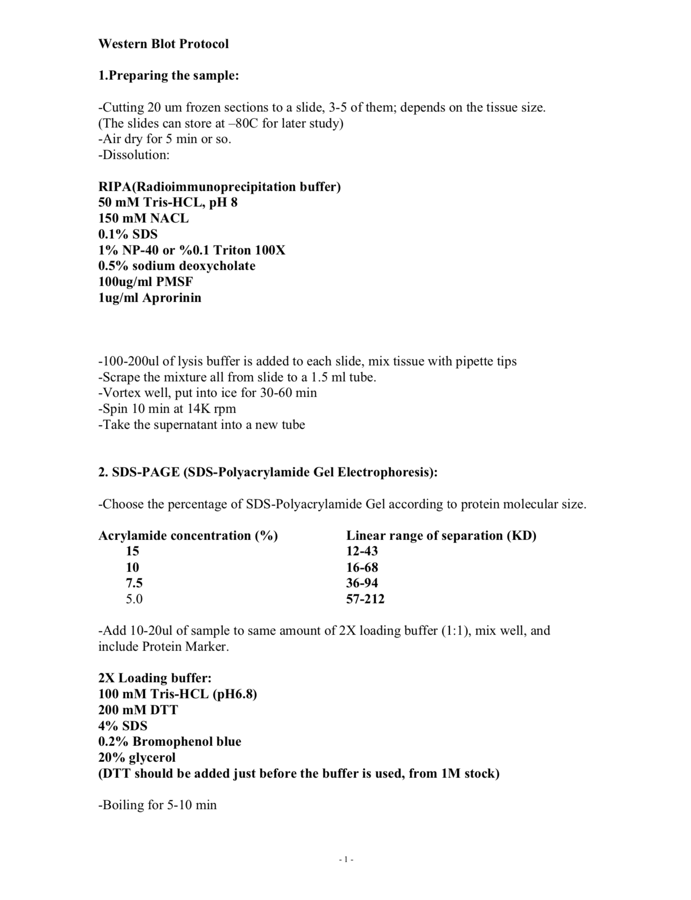
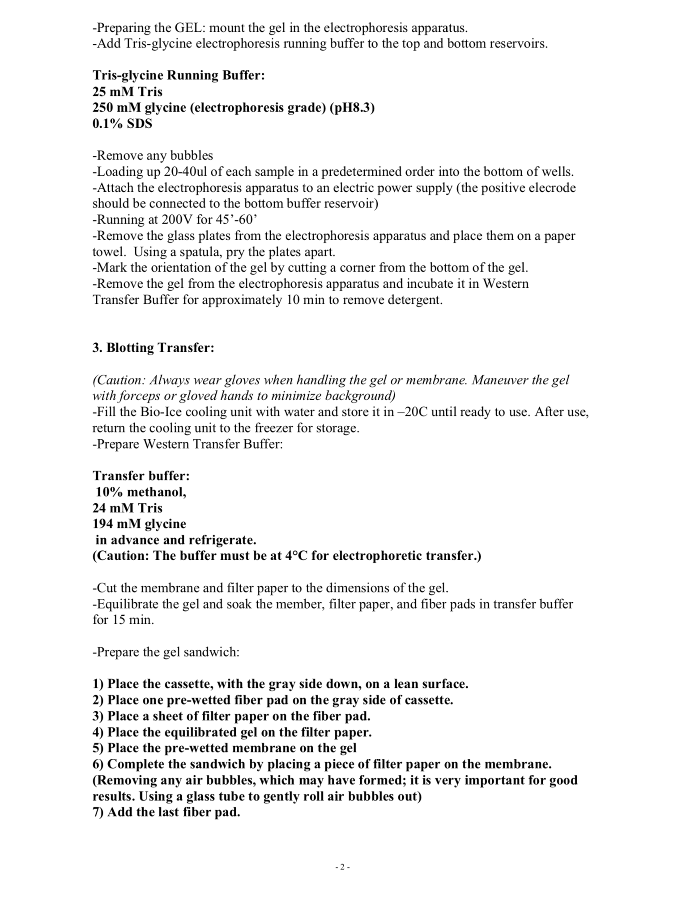
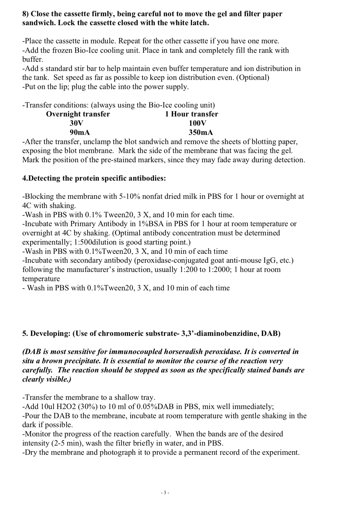

# Yale Wet Lab Protocols

This is a repository for `YSM Gunel Lab - Wet Lab Protocols`. 

## Prepared by:

**Name:** [Batur Gültekin](https://www.linkedin.com/in/baturgultekin/)

**E-mail:** baturgultekin@sabanciuniv.edu , batur.gultekin@yale.edu

__________

### Zebrafish Primer Prep Guide

- Go to: https://zfin.org/
- Search for sa number of the gene
- Copy last 40 bases of the mutated sequence
- Go to: https://genome.ucsc.edu/cgi-bin/hgBlat
- Select Zebrafish genome and latest assebmly for the organism
- Paste the copied sequence part and submit
- Click on the browser of the targetted chromosome
- Zoom in to the mutation site at the end
- View in DNA form, add preferably 500 or 700 bases extra to both up and downstreams, all upper case and mask repeats to N. Get DNA, and copy the DNA seq.
- Go to: https://www.bioinformatics.nl/cgi-bin/primer3plus/primer3plus.cgi
- Change the task to Primer_List, primer size (18,19,21), primer tm (57,58,60), number to return (20) and gc clamp (preferably 2 or 1)
- Paste and submit the copied sequence
- Select the left and right primers

__________

### 2% Agarose Gel

Measure 3g of agarose
- Mix agarose powder with 150mL 1xTAE in a microwavable flask
- Microwave for 1-3 min until the agarose is completely dissolved (but do not overboil the solution, as some of the buffer will evaporate and thus alter the final percentage of agarose in the gel.
- Add ethidium bromide (EtBr) to a final concentration of approximately 0.3-0.6 μg/mL (usually about 2-3 μl of lab stock solution per 100 mL gel) or 1Oμl GreenGlow per 100mL TAE Agorose mix.

__________

### DNA Isolation 1x

Prepare 100 μl DNA Isolation Mix:
- 88 μl of nucleas-free water (non-DEPC-Treated)
- 10 μl of Kappa DNA Isolation Buffer
- 2 μl of Kappa DNA Isolation Enzyme

Add 100 μl of DNA Isolation mix to 96 well plate which contains the tissue
- Seal and mark the plate
- Run in the PCR machine

__________

### PCR 1x

Prepare 22 μl PCR Mix:
- 7 μl of nucleas-free water (non-DEPC-Treated)
- 1.25 μl of forward primer designed for the targetted region
- 1.25 μl of reverse primer designed for the targetted region
- 12.5 μl of Kappa PCR Enzyme

Fill 96 well plate wells with 22 μl PCR Mix
- Add 3 μl of DNA from the 1:10 diluted DNA Isolation product
- Seal and mark the plate
- Run in the PCR machine

__________

### Sequencing Preperation

Prepare 15 μl Sequencing Mix:
- 13 μl of nucleas-free water (non-DEPC-Treated)
- 2 μl of forward primer designed for the targetted region

Fill 96 well plate wells with 15 μl Sequencing Mix
- Add 3 μl of DNA from the PCR product
- Seal and mark the plate and put into a zip bag with the order info
- Place the plate in the Keck Sequencing Bucket 

__________

### qPCR

__________

### Western Blot

__________
